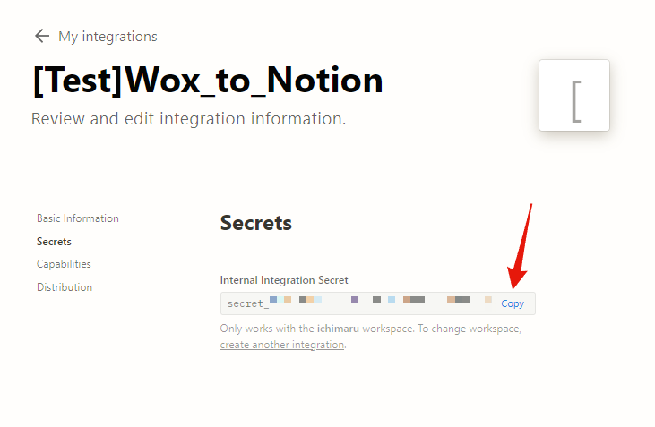
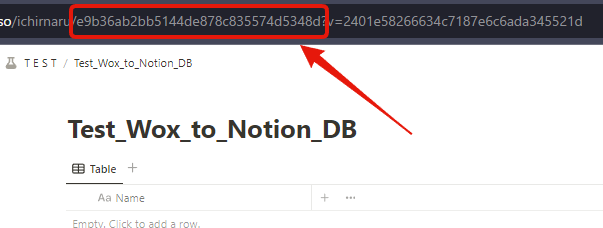

# Wox to Notion

Wox から、Notion データベースに素早く入力


---

- [Wox to Notion](#wox-to-notion)
  - [インストール方法](#インストール方法)
    - [Notion の設定](#notion-の設定)
    - [ローカル設定](#ローカル設定)
  - [使い方](#使い方)
  - [バグの報告、機能追加要望](#バグの報告機能追加要望)

## インストール方法

### Notion の設定

- Notion インテグレーションから新しいインテグレーションを作成[Notion Integrations](https://www.notion.so/my-integrations)  
  
- 名前は必須項目になりますが、任意の名前で構いません(この先[Test]Wox_to_Notion で進めます。)  
  
- シークレットトークンをコピーします。`Notion_TOKEN`として後で使用します。  
  

- Wox to Notion から登録したいデータベースをフルページで開きます(そのデータベースがリンクドビューの場合はうまく設定できません。)
- データベース ID をコピーします。`NOTION_DATABASE_ID`として後で使用します。  
  `https://www.notion.so/user_id/[Database_id]?v=YYYYYYYYYYYYYYYYYYYYYYYYYYYYYYYY`  
  

- そのページのまま、右上の 3 点リーダーからコネクトを開きます。
- 先ほど名前を付けたインテグレーションにデータベースの操作の権限を許可します。  
  

- 以上で、Notion 側の設定は終わりです。

---

### ローカル設定

- Wox をインストールしているディレクトリまで移動し Plugins フォルダに、このリポジトリをクローンください。  
  `>cd ~\wox\1.X.XXX(wox version)\Plugins`

```shell
git clone https://github.com/IchimaruShoma/Wox_to_Notion.git
```

- `.env`ファイルを、Wox to Notion 直下に作成します。  
  `~\Plugins\Wox_to_Notion\.env`
- 先ほどコピーしてきた`NOTION_TOKEN`と`NOTION_DATABASE_ID`を作成した.env ファイルに記入します。

```json
{
  "token": "NOTION_TOKEN",
  "id": "NOTION_DATABASE_ID"
}
```

- [wox.py](https://github.com/Wox-launcher/Wox/blob/master/JsonRPC/wox.py)をプロジェクトフォルダ直下に保存  
  `~\Plugins\Wox_to_Notion\wox.py`

---

## 使い方

- wox を起動
- `wn [メモ、タスク]`

---

## バグの報告、機能追加要望

問題を報告するには、Issues を作成してください。対応いたします。

---
