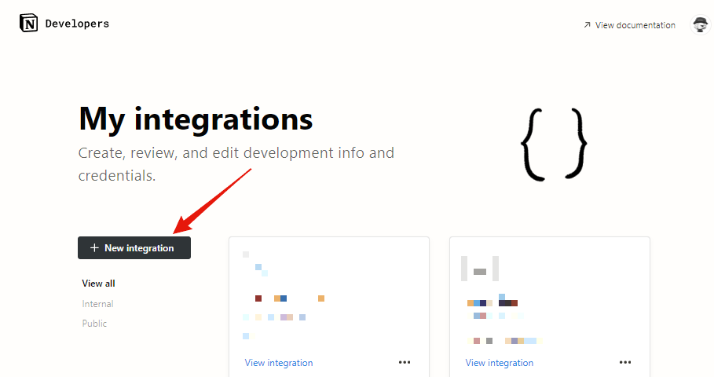

# Wox to Notion

Enter notes from Wox to NotionDB  
  
  

---

- [Wox to Notion](#wox-to-notion)
  - [Install](#install)
    - [Notion Setting](#notion-setting)
    - [Connections setting](#connections-setting)
    - [Local Setting](#local-setting)
    - [Usage](#usage)
    - [Bug reports \& feature requests](#bug-reports--feature-requests)

## Install

### Notion Setting

- Create [Notion Integrations](https://www.notion.so/my-integrations)  
  
- Set to any name  
  
- Copy Token  
  

**Keep your API secret a secret!**
Any value used to authenticate API requests should always be kept secret.
Use environment variables and avoid committing sensitive data to your version control history.

If you do accidentally expose it, remember to “refresh” your secret.

- Open the database you want to register in full page.(At this time, **Linked View** will not connect properly.)
- Copy database ID  
  `https://www.notion.so/user_id/[Database_id]?v=YYYYYYYYYYYYYYYYYYYYYYYYYYYYYYYY`  
  

---

### Connections setting

- Open the database you want to register in full page.
- Press the three-point reader in the upper right corner.
- Select your registered integrations from the connections at the bottom.  
  

---

### Local Setting

- Navigate to the directory where Wox is installed. Clone this repository.  
  `~\wox\1.X.XXX(wox version)\Plugins`

```shell
git clone https://github.com/IchimaruShoma/Wox_to_Notion.git
```

- Create `.env`  
  `~\Plugins\Wox_to_Notion\.env`

```json
{
  "token": "YOUR_NOTION_TOKEN",
  "id": "YOUR_NOTION_DATABASE_ID"
}
```

- Add [wox.py](https://github.com/Wox-launcher/Wox/blob/master/JsonRPC/wox.py)  
  `~\Plugins\Wox_to_Notion\wox.py`

---

### Usage

- Launch wox
- Type `wn [Add your Memo, Task, Diary, etc...]`
- Enjoy !🎉

---

### Bug reports & feature requests

To report an issue, please create a new Issue.
